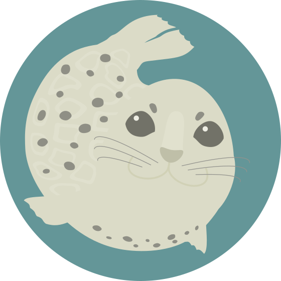

# azaraC

<!--  -->

    

[![Release](https://img.shields.io/github/v/release/A-vrice/azaraC?style=flat-square&logo=data:image/svg+xml;base64,PHN2ZyB4bWxucz0iaHR0cDovL3d3dy53My5vcmcvMjAwMC9zdmciIHhtbDpzcGFjZT0icHJlc2VydmUiIGlkPSJfeDMyXyIgeD0iMCIgeT0iMCIgc3R5bGU9IndpZHRoOjQ4cHg7aGVpZ2h0OjQ4cHg7b3BhY2l0eToxIiB2aWV3Qm94PSIwIDAgNTEyIDUxMiI+PHN0eWxlPi5zdDB7ZmlsbDojNGI0YjRifTwvc3R5bGU+PHBhdGggZD0iTTM3OC40IDBIMTk1LjFsLTkuMyA5LjNMNTcgMTM4LjFsLTkuMyA5LjN2Mjc4LjdhODYgODYgMCAwIDAgODUuOSA4NS45aDI0NC44YTg2IDg2IDAgMCAwIDg1LjktODUuOVY4NmE4NiA4NiAwIDAgMC04NS45LTg2bTU0IDQyNi4xYTU0IDU0IDAgMCAxLTU0IDU0LjFIMTMzLjZhNTQgNTQgMCAwIDEtNTQtNTRWMTYwLjVoODMuNmE0NSA0NSAwIDAgMCA0NS00NVYzMS43aDE3MC4yYTU0IDU0IDAgMCAxIDU0IDU0LjF6IiBjbGFzcz0ic3QwIiBzdHlsZT0iZmlsbDojZmZmZmZmIi8+PHBhdGggZD0iTTIwNy41IDI3Ni4xYzQuNy02LjkgNS44LTkuNyA1LjgtMTMuOCAwLTUuMi0zLjUtOS41LTEwLjUtOS41aC00My40Yy02IDAtOS41IDMuOC05LjUgOSAwIDUuMSAzLjUgOC44IDkuNSA4LjhoMjkuM3YuMmwtMzQgNTAuMmMtNC42IDYuNi02LjMgOS45LTYuMyAxNC42IDAgNS4yIDMuNiA5LjUgMTAuNCA5LjVoNDVjNi4xIDAgOS41LTMuNiA5LjUtOC44IDAtNS4xLTMuNC05LTkuNS05SDE3M3YtLjJ6bTQwLjItMjQuMWMtNS45IDAtMTAgNC4yLTEwIDEwLjZ2NzIuOGMwIDYuNCA0LjEgMTAuNiAxMCAxMC42IDUuNyAwIDkuOS00LjIgOS45LTEwLjZ2LTcyLjhjMC02LjQtNC4yLTEwLjYtMTAtMTAuNm03NS43LjhoLTI4LjVjLTUuNCAwLTguNyAzLjUtOC43IDguOHY3My44YzAgNi40IDQuMiAxMC42IDEwIDEwLjZzMTAtNC4yIDEwLTEwLjZWMzEzcTAtLjkuOC0uOWgxNi40YzIwLjEgMCAzMi4yLTEyLjIgMzIuMi0yOS42IDAtMTcuNi0xMi0yOS43LTMyLjItMjkuN20tMS4yIDQySDMwN3EtLjggMC0uOC0uN3YtMjMuM3EwLS44LjgtLjhoMTUuMmM4LjQgMCAxMy41IDUgMTMuNSAxMi41cy01IDEyLjQtMTMuNSAxMi40IiBjbGFzcz0ic3QwIiBzdHlsZT0iZmlsbDojZmZmZmZmIi8+PC9zdmc+)](https://github.com/A-vrice/azaraC/releases)  [![License: MIT](https://img.shields.io/badge/License-MIT-blue?style=flat-square&logo=data:image/svg+xml;base64,PHN2ZyB4bWxucz0iaHR0cDovL3d3dy53My5vcmcvMjAwMC9zdmciIHdpZHRoPSI4MDAiIGhlaWdodD0iODAwIiBhcmlhLWhpZGRlbj0idHJ1ZSIgdmlld0JveD0iMCAwIDE0IDE0Ij48cGF0aCBkPSJNMi4xNzggMTAuMjY2di0uOTkxaC4yNjh2MS43NjdoLjQ4MmMuNDQ2IDAgLjQ4Mi4wMS40ODIuMTA4IDAgLjEtLjAzNi4xMDctLjYxNi4xMDdoLS42MTZ6bTEuNTUzLjI0YzAtLjcxMy4wMDUtLjc0OS4xMDctLjc0OXMuMTA4LjAzNi4xMDguNzUtLjAwNS43NS0uMTA4Ljc1Yy0uMTAyIDAtLjEwNy0uMDM2LS4xMDctLjc1bS43NzguNjIzYy0uMjc0LS4yNzQtLjI5OC0uOTEyLS4wNDUtMS4yMTNhLjY2LjY2IDAgMCAxIC42MzctLjE5Yy4xNjYuMDQzLjM5OC4yNjEuMzk4LjM3NyAwIC4xMzItLjIzNC4xMDItLjI5Ni0uMDM4LS4wNTYtLjEyOC0uMjIzLS4xNzctLjQyNy0uMTI2LS4zNC4wODUtLjMwMiAxLjA0NS4wNDUgMS4xMzNhLjM4LjM4IDAgMCAwIC40MS0uMTkyYy4wNjgtLjEyNi4yNjgtLjE0Mi4yNjgtLjAyIDAgLjA0NS0uMDcuMTU0LS4xNTcuMjQtLjEzMi4xMzItLjE5OS4xNTctLjQzLjE1Ny0uMjE5IDAtLjMwMi0uMDI2LS40MDMtLjEyOG0xLjQxOS0uMDI0Yy0uMjgxLS4yODEtLjI4Mi0uODktLjAwMi0xLjIwMy4xMzctLjE1My4xODQtLjE3MS40NDYtLjE3MS4yMTggMCAuMzI1LjAyOC40MTQuMTA3YS45Mi45MiAwIDAgMSAuMjY2LjU4N3YuMTM2SDUuOTY3bC4wMzQuMTc0Yy4wNjUuMzM4LjQxOS40NjguNjkuMjU0LjE2Ny0uMTMxLjMzMy0uMTQ0LjI4Ni0uMDIyYS42LjYgMCAwIDAtLjAzMi4xMDZjMCAuMDcyLS4zNi4xODQtLjU5LjE4NC0uMjMxIDAtLjMtLjAyNS0uNDI3LS4xNTJ6bS44NTYtLjgxNmMwLS4wOC0uMTEyLS4yODMtLjE4Mi0uMzNhLjUuNSAwIDAgMC0uMjItLjA0Yy0uMTkgMC0uMjU3LjA0LS4zNC4xOTctLjExLjIxLS4wNzguMjMuMzQuMjMuMjQ5IDAgLjQwMi0uMDIxLjQwMi0uMDU2em0uNTkuMjE4YzAtLjcxNC4wMDQtLjc1LjEwNi0uNzVxLjEwOC0uMDAxLjEwNy4xMTJjMCAuMTA4LjAwNi4xMDcuMTY1LS4wMjcuMjE4LS4xODMuNDg5LS4xODYuNjY4LS4wMS4xMjUuMTI1LjEzMS4xNjMuMTMxLjc3NyAwIC42MS0uMDA2LjY0NS0uMTA3LjY0NXMtLjEwNy0uMDM2LS4xMDctLjUzMmMwLS43LS4wNDEtLjgwNy0uMzEyLS44MDctLjMzNCAwLS4zOTcuMTE1LS40MjcuNzc3LS4wMjIuNTA0LS4wMzUuNTYyLS4xMjUuNTYyLS4wOTMgMC0uMS0uMDUzLS4xLS43NXptMS42NzkuNjg3YS40NC40NCAwIDAgMS0uMTczLS4xODRjLS4wNTEtLjExMi0uMDQ1LS4xMjguMDQ3LS4xMjguMDU5IDAgLjE1NS4wNDguMjEzLjEwNy4wNy4wNy4xNzkuMTA3LjMxMi4xMDcuMjYgMCAuNC0uMS4zNzYtLjI3LS4wMTQtLjEwNC0uMDY5LS4xNDYtLjI2LS4yMDItLjQxNS0uMTItLjU4OS0uMjE5LS42NDQtLjM2My0uMTY3LS40NC41NjQtLjcyNC45OTMtLjM4Ny4xNTYuMTIzLjE2OC4xOC4wNDUuMjI3LS4wNTMuMDIxLS4xMjctLjAxLS4xODktLjA3NS0uMTIxLS4xMy0uNDc5LS4xNDktLjU3Ny0uMDMxLS4xMjkuMTU1LS4wNC4yNTguMzMuMzc4LjQ1Ni4xNDguNTI1LjIwNy41MjQuNDQ4IDAgLjIyNC0uMDM1LjI4OC0uMTk2LjM3NC0uMTQ0LjA3NS0uNjQ1LjA3NS0uODAxIDB6bTEuNTQ1LS4wMmMtLjI3LS4xOS0uMzY3LS43MjktLjItMS4xMjYuMTQ5LS4zNTguNzQ2LS40NTQgMS4wMzUtLjE2NS4xMjMuMTI0LjI1LjU4LjE4LjY1LS4wMTUuMDE1LS4yNTIuMDI3LS41MjcuMDI3LS41IDAtLjUgMC0uNS4xMzcgMCAuMzI0LjQ2OC41Mi42OTcuMjkyLjA1OS0uMDYuMTQzLS4xMDcuMTg3LS4xMDcuMTI3IDAgLjA5NC4xNDItLjA2LjI2NC0uMTc1LjEzNy0uNjMzLjE1My0uODEyLjAyN3ptLjc3LS45MTJhLjUuNSAwIDAgMS0uMDMyLS4xM2MwLS4xMS0uMTgzLS4yMTQtLjM3NS0uMjE0LS4yMiAwLS4zNzQuMTM4LS4zNzQuMzMzIDAgLjA4My4wNTIuMDk1LjQwNy4wOTUuMzUgMCAuNDAzLS4wMTIuMzc1LS4wODV6bS03LjYzNy0uOTZjMC0uMDk4LjAyOS0uMTM0LjEwNy0uMTM0LjA3OSAwIC4xMDguMDM2LjEwOC4xMzRzLS4wMy4xMzQtLjEwOC4xMzQtLjEwNy0uMDM2LS4xMDctLjEzNE0xLjY0MyA4LjIzMXYtLjI5NUgxdi0uNTg5aC42NDN2LS41ODlIMVYyLjc0MWg1LjA4OHY0LjAxMmwtLjMwOC4wMTYtLjMwOC4wMTYtLjAxNi4yOC0uMDE3LjI4MmguNjQ5di41ODloLS42NDJ2LjU4OWgtLjY0NHYtLjU4OWguNjQzdi0uNTg5aC0uNjQ4bC4wMTYtLjI4MS4wMTYtLjI4MS4zMDgtLjAxNi4zMDgtLjAxNnYtLjUyNWwtLjMwOC0uMDE2LS4zMDgtLjAxNi0uMDE0LTEuMDg1TDQuOCA0LjAyN2gtLjc0N3Y0LjQ5OWgtLjk2NHYtNC41aC0uODA0djIuMTk3aC0uNjQydi41MzVoLjY0MnYuNTg5aC0uNjQydi41OWguNjQydi41ODloLS42NDJ6bTUuMTk1LTIuNTk4VjIuNzQxaDEuMjg1djUuNzg0SDYuODM4em00LjA3IDIuNTk4di0uMjk1aC0uNTg5di0uNTg5aC41ODl2LS41ODloLS42MTZsLjAxNS0xLjM2Ni4wMTUtMS4zNjVIOC44NzNWMi43NEgxM2wtLjAxNS42M0wxMi45NyA0bC0uNzEuMDE1LS43MS4wMTV2Mi4xOTNoLS42NDhsLjAxNi4yNTQuMDE3LjI1NC4zMDguMDE2LjMwOC4wMTZ2LjU3OWwtLjMwOC4wMTYtLjMwOC4wMTZ2LjUzNWwuMzA4LjAxNi4zMDguMDE2di41ODRoLS42NDN6IiBzdHlsZT0iZmlsbDojZmYwMDAwIi8+PC9zdmc+)](https://github.com/A-vrice/azaraC/blob/main/LICENSE)  

[](https://app.codacy.com/gh/A-vrice/azaraC/dashboard) [](https://app.codacy.com/gh/A-vrice/azaraC/dashboard) [](https://scorecard.dev/viewer/?uri=github.com/A-vrice/azaraC) [![SLSA Level3](https://img.shields.io/badge/SLSA-Level3-brightgreen?style=flat-square&logo=data:image/svg+xml;base64,PHN2ZyB4bWxucz0iaHR0cDovL3d3dy53My5vcmcvMjAwMC9zdmciIHZpZXdCb3g9IjAgMCA3MDAgNzAwIj48cGF0aCBmaWxsPSIjZmY2NzQwIiBkPSJNMTI1IDFRODIgNiA1MCAzM0MzOSA0MyAyNCA1OSAyNSA2MWw4IDEyIDcgMTIgMzQgNDYgMjAgMjRhMTAzNCAxMDM0IDAgMCAwIDcyIDc1cTExIDExIDEyIDhhODM4IDgzOCAwIDAgMCAyMTMtODRsNTMtMzNhODI0IDgyNCAwIDAgMCA5Ni03Nmw0My00My0zLTF6bTQ5NiAzNGE4OTQgODk0IDAgMCAxLTk4IDkwbC0xNSAxMi0xOCAxMy03NyA0OGMtOCA2LTUzIDI5LTcwIDM2YTg5NyA4OTcgMCAwIDEtMTExIDQybC03IDIgOSA4IDEyIDkgNDkgMzJhODY4IDg2OCAwIDAgMCA4NSA0NWw0NiAxOSA1IDIgMTMgNSAzMyAxMSA3IDIgOC02YzktNiAzMS0yNSAzOS0zMmwxMy0xMmE5MTAgOTEwIDAgMCAwIDY2LTY5bDExLTE0YzMtMiAyOS0zOCAzMi00Mmw0MC02MSA3LTExdi0xOWwtMi0yNi0yLTEwYy0xLTctNy0yNS0xMS0zMmExNDYgMTQ2IDAgMCAwLTQ4LTU0bC0zLTJ6TTEgMTE5djQ2MmgxOGwyMi0xIDEyLTIgMTEtMSA5LTEgMTgtMiAxNC0yIDktMSA4LTEgNy0yIDIxLTMgNy0yIDctMiA3Ny0yMSA3MC0yNyAxMy02YTk3MiA5NzIgMCAwIDAgODEtNDJsMjgtMTctNi0zYTg4OSA4ODkgMCAwIDEtMjY0LTE1MWwtNy01LTctNy03LTYtMTItMTEtNjUtNjYtNTMtNjgtMTAtMTN6Ii8+PHBhdGggZmlsbD0iI2ZmNjc0MCIgZD0iTTY5OCAyNTlhOTM3IDkzNyAwIDAgMS02MSA3NyA5ODQgOTg0IDAgMCAxLTczIDc1IDg2NyA4NjcgMCAwIDEtMjQ1IDE1M2wtMTcgNy0xMyA1LTIwIDctNjAgMTlhOTM2IDkzNiAwIDAgMS0xMTUgMjNsLTkgMS0xOSAyLTEwIDEtMTQgMS0yMiAxYy0xIDIgMTIgMTggMjAgMjdsMTUgMTMgMjIgMTRxMTUgOCAzNSAxMmwxMCAzaDQ1NmwxMC0zYTE0MSAxNDEgMCAwIDAgMTEwLTExM2MyLTExIDItMTYgMi0xNjlWMjU3eiIvPjwvc3ZnPg==)](https://slsa.dev)

準天頂衛星みちびき(QZSS)から発信されたL1S信号の災害通報メッセージをデコードするArduino向けC++17ライブラリ。[azarashi](https://github.com/nbtk/azarashi)(Python)の移植です。外部依存やヒープの割り当てなどは行なわないようにしています。

## 対応メッセージ

| msg_type | 規格            | 名称            |
| -------- | --------------- | --------------- |
| 43       | [IS-QZSS-DCR-016](https://qzss.go.jp/technical/download/is_qzss_dcr_016_agree.html) | DCR 12種類（QZQSM） |
| 44       | [IS-QZSS-DCX-004](https://qzss.go.jp/technical/download/is_qzss_dcx_004_agree.html) | DCX / CAMF（L-Alert, J-Alert など） |

定義テーブル生成に使用したazarashiのバージョンは[`.azarashi-version`](.azarashi-version)を参照のこと。

## インストール

git clone で直接導入できます:

```bash
# Arduino IDE
git clone https://github.com/A-vrice/azaraC <PROJECT_DIR>/libraries/azaraC

# PlatformIO
git clone https://github.com/A-vrice/azaraC <PROJECT_DIR>/.pio/libdeps/<TARGET_BOARD>/azaraC
```

> **注:** Library Manager / `pio pkg install` は未申請のため現時点で利用できません。

## ドキュメント

- [はじめに（クイックスタート・Examples・コンパイル時設定）](docs/getting-started.md)
- [API リファレンス](docs/api-reference.md)
- [アーキテクチャ](docs/architecture.md)
- [開発者ガイド（ビルド・テストなど）](docs/developer-guide.md)

## ライセンス

[MIT](LICENSE)

本ライブラリは非公式なものであり，準天頂衛星システムサービス株式会社，JAXA，その他公共機関など，「みちびき」に関連する組織，NBTK氏の提供するazarashiとは一切関係ありません。また，あるふぁ米およびそのコントリビューターは，受信したメッセージや本ライブラリの出力内容の正確性，完全性，その他のいかなるものについても保証しません。本ライブラリを使用したことによるいかなる損害についても責任は負いかねます。本ライブラリは現状有姿で提供されます。また，本ライブラリを利用される際はQSSの免責条項[参考](https://qzss.go.jp/technical/dod/dc-report/users-manual_agree.html)を確認することを推奨します。

## 連絡先

不具合や、疑問点は[Issue](https://github.com/A-vrice/azaraC/issues)または[作者メールアドレス](mailto:azaraC@vrice.f5.si)までお願いします。
