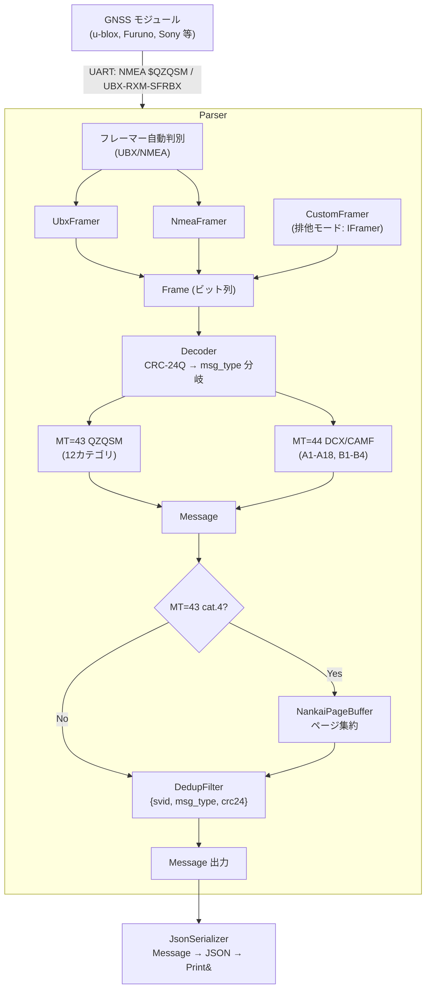
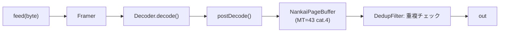
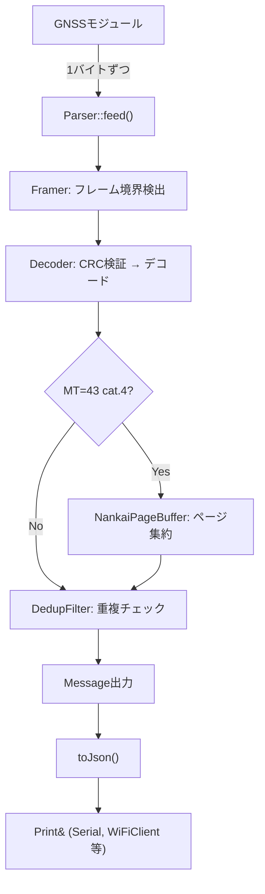

# AzaraC アーキテクチャドキュメント

## 概要

AzaraCは準天頂衛星システム（QZSS）のL1S信号から災危通報メッセージをデコードするArduinoライブラリです。本ドキュメントでは、ライブラリの内部アーキテクチャと設計思想について解説します。

ファイル構成は[開発者ガイド](developer-guide.md#プロジェクト構造)を参照してください。

## システム構成図

## コンポーネント詳細

### 1. Parser (パーサー)

[`Parser`](../src/Parser.h)はライブラリのメインエントリーポイントです。

- **フレーマー自動判別**: 入力バイトストリームからUBX/NMEAを自動判別（UBX同期文字`0xB5 0x62`、NMEA`$`文字で判定）
- **メッセージデコード**: フレームの復号とCRC検証
- **重複除去 + 南海トラフページ集約**: `postDecode()` がNankai集約・重複チェック・メッセージ出力を一元管理

### 2. Framer (フレーマー)

[`IFramer`](../src/framer/IFramer.h)インターフェースを実装:

| フレーマー | プロトコル | 対応デバイス |
|-----------|-----------|-------------|
| [`UbxFramer`](../src/framer/UbxFramer.h) | UBX-RXM-SFRBX | u-blox M10, ZED-F9P |
| [`NmeaFramer`](../src/framer/NmeaFramer.h) | NMEA $QZQSM | Furuno GT-87, 汎用GNSS |
| Custom (IFramer) | 任意 | Sony, その他 |

### 3. Decoder (デコーダー)

[`Decoder`](../src/decoder/Decoder.h)はビット列からメッセージフィールドを抽出します。

**共通処理**: CRC-24Q検証（IS-QZSS-L1S §3.2.8準拠）、MSB-firstビット抽出、UNIX時刻ベースの年月補正。

**MT=43**: `DecoderQzqsm`がX-macroテーブル`AZARAC_DC_CATEGORIES`から全12カテゴリのサポート判定・ディスパッチを生成。カテゴリ一覧は[APIリファレンス](api-reference.md#azaracmt43data-mt43-qzqsm)を参照。

**MT=44**: 階層構造のCAMFフォーマット（A1-A18 + B1-B4拡張）を解析。サービス種別（L-Alert, J-Alert 等）の判定条件は[APIリファレンス](api-reference.md#azaracmt44data-mt44-dcxcamf)を参照。

### 4. DedupFilter (重複除去)

[`DedupFilter`](../src/internal/Dedup.h)は`{svid, msg_type, crc24}`によるリングバッファで重複除去。デフォルト8スロット。複数衛星受信時は `AZARAC_DEDUP_SLOTS`を増やす。

### 5. NankaiPageBuffer (南海トラフページ集約)

[`NankaiPageBuffer`](../src/internal/NankaiPageBuffer.h)は最大63ページに分割される南海トラフ地震メッセージを集約。`MAX_PAGES×18+1`バイトのメモリを確保し、受信したページをビットマップで管理しながら直接書き込む（ソート不要）。バッファが全て使用中の場合はLRUエビクションで最も古いバッファから解放。

### 6. JsonSerializer (JSONシリアライザ)

[`JsonSerializer`](../src/json/JsonSerializer.h)はMessageをJSON形式にシリアライズ。ヒープアロケーションなし、固定バッファで処理。`Print&` 経由で出力（Serial, WiFiClient等）。日本語/英語ラベルの選択的コンパイル対応。

## データフロー

## メモリ設計

| コンポーネント | メモリ使用量 | 備考 |
|---------------|-------------|------|
| DedupFilter | `AZARAC_DEDUP_SLOTS × 8` B + 4B 管理 | デフォルト68B（`DedupKey` はアラインメント込み 8B/スロット） |
| NankaiPageBuffer | 28B（メタデータ）+ `MAX_PAGES × 18 + 1` B | 既定 63 ページで構造体 1,168B。LRUエビクション |
| 定義テーブル | 表エントリ約122KB + 文字列実体。文字列はリンカが重複統合（全て有効時 64bit `g++ -O2 -fdata-sections` で `.rdata` 289KB） | Flash(AVRではPROGMEM)に配置。非AVRはエントリを `const char*`（32bit機で4B）で保持。AVRプリセット（`-D__AVR__ -DAZARAC_AVR_STUB`）では約3.4KB |

## 関連ドキュメント

- [API リファレンス](api-reference.md)
- [開発者ガイド](developer-guide.md)
