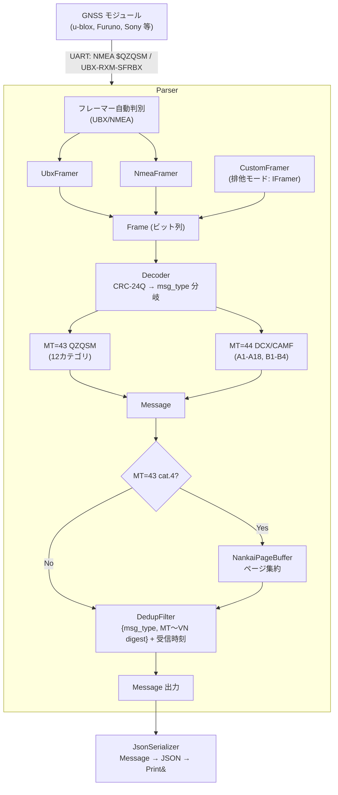
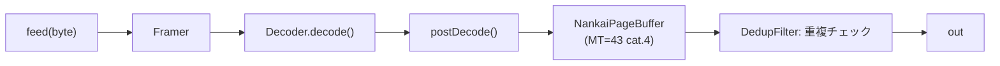
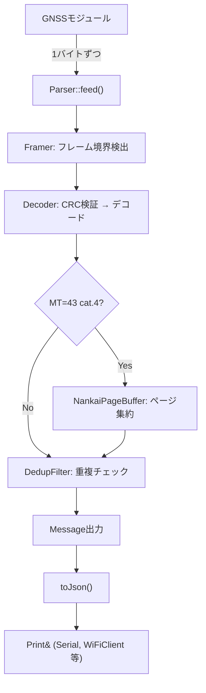

# azaraC アーキテクチャドキュメント

## 概要

azaraC は準天頂衛星システム（QZSS）の L1S 信号から災危通報メッセージをデコードする Arduino ライブラリです。本ドキュメントでは、ライブラリの内部アーキテクチャと設計思想について解説します。

ファイル構成は[開発者ガイド](developer-guide.md#プロジェクト構造)を参照してください。

## システム構成図

```mermaid
graph TD
    GNSS["GNSS モジュール<br/>(u-blox, Furuno, Sony 等)"]
    GNSS -->|"UART: NMEA $QZQSM / UBX-RXM-SFRBX"| Parser

    subgraph Parser
        FramerAuto["フレーマー自動判別<br/>(UBX/NMEA)"]
        UBX["UbxFramer"]
        NMEA["NmeaFramer"]
        FramerAuto --> UBX
        FramerAuto --> NMEA
        Custom["CustomFramer<br/>(排他モード: IFramer)"]
        UBX --> Frame
        NMEA --> Frame
        Custom --> Frame
        Frame["Frame (ビット列)"]
        Frame --> Decoder
        Decoder["Decoder<br/>CRC-24Q → msg_type 分岐"]
        Decoder --> MT43["MT=43 QZQSM<br/>(12カテゴリ)"]
        Decoder --> MT44["MT=44 DCX/CAMF<br/>(A1-A18, B1-B4)"]
        MT43 --> Msg["Message"]
        MT44 --> Msg
        Msg --> Nankai{"MT=43 cat.4?"}
        Nankai -->|"Yes"| NankaiBuf["NankaiPageBuffer<br/>ページ集約"]
        Nankai -->|"No"| Dedup["DedupFilter<br/>{msg_type, MT～VN digest} + 受信時刻"]
        NankaiBuf --> Dedup
        Dedup --> Out["Message 出力"]
    end

    Out --> Serializer
    Serializer["JsonSerializer<br/>Message → JSON → Print&"]
```

## コンポーネント詳細

### 1. Parser (パーサー)

[`Parser`](../src/Parser.h)はライブラリのメインエントリーポイントです。

- **フレーマー自動判別**: 入力バイトストリームからUBX/NMEAを自動判別（UBX同期文字`0xB5 0x62`、NMEA`$`文字で判定）
- **メッセージデコード**: フレームの復号とCRC検証
- **重複除去 + 南海トラフページ集約**: `postDecode()` がNankai集約・重複チェック・メッセージ出力を一元管理

```mermaid
graph LR
    A["feed(byte)"] --> B["Framer"]
    B --> C["Decoder.decode()"]
    C --> D["postDecode()"]
    D --> E["NankaiPageBuffer<br/>(MT=43 cat.4)"]
    E --> F["DedupFilter: 重複チェック"]
    F --> G["out"]
```

### 2. Framer (フレーマー)

[`IFramer`](../src/framer/IFramer.h)インターフェースを実装:

| フレーマー | プロトコル | 対応デバイス |
|-----------|-----------|-------------|
| [`UbxFramer`](../src/framer/UbxFramer.h) | UBX-RXM-SFRBX | u-blox M10, ZED-F9P |
| [`NmeaFramer`](../src/framer/NmeaFramer.h) | NMEA $QZQSM | Furuno GT-87, 汎用GNSS |
| Custom (IFramer) | 任意 | Sony, その他 |

`Frame::svid` は QZSS L1S PRN を入れる契約です。Satellite ID は「PRN を表す 8bit の下位 6bit」（IS-QZSS-DCR-017 §4.3.1）なので、`NmeaFramer` は常に `svid | 0x80` して PRN に直します（仕様上有効な Satellite ID 53–63 → PRN 181–191）。`UbxFramer` は `ublox_qzss_svid_prn_map` に該当する場合だけ PRN へ変換し、表に無い `svId` はそのまま通します。`JsonSerializer` は `svid` を数値のまま出力し、ラベルは付けません。

### 3. Decoder (デコーダー)

[`Decoder`](../src/decoder/Decoder.h)はビット列からメッセージフィールドを抽出します。

**共通処理**: CRC-24Q検証（IS-QZSS-L1S §3.2.8準拠）、MSB-firstビット抽出、UNIX時刻ベースの年月補正。

**MT=43**: `DecoderQzqsm`がX-macroテーブル`AZARAC_DC_CATEGORIES`から全12カテゴリのサポート判定・ディスパッチを生成。カテゴリ一覧は[APIリファレンス](api-reference.md#azaracmt43data-mt43-qzqsm)を参照。

**MT=44**: 階層構造のCAMFフォーマット（A1-A18 + B1-B4拡張）を解析。サービス種別（L-Alert, J-Alert等）の判定条件は[APIリファレンス](api-reference.md#azaracmt44data-mt44-dcxcamf)を参照。

### 4. DedupFilter (重複除去)

[`DedupFilter`](../src/internal/Dedup.h)はアプリケーションノートv2（p.23–25）の重複判定をそのまま実装します。

- **同一性は MT～VN**: 250ビットのフレームに衛星IDは含まれないため、受信衛星は鍵に含めません（複数衛星から中継された同一情報を1回だけ通知するため）。照合対象は仕様どおり MT～VN（フレーム bit 8..219 = 212 bit）で、その CRC-24Q を鍵にします。**プリアンブル（bit 0..7）も Reserved（bit 220..225）も含めません**: 仕様は「MT～Vn の 212bit について比較する」と定めており、プリアンブルは放送で A(0x53)→B(0x9A)→C(0xC6) と巡回、Reserved 6 bit も 16 値が巡回します。どちらを含めても同一情報が分裂します（能登半島地震の実データ: 正しい 212 bit で distinct 162 に対し、Reserved を含む 218 bit では 1,764、250 ビット全体では 3,697）。
- **情報有効時間**: 手順④'「一定時間受信しなかった情報は履歴から削除する」に従い、`window_ms`以内に再受信した情報だけを重複と判定します。再受信のたびに有効時間は更新されます。窓は災害種別ごとの配信終了条件（アプリケーションノートv2 p.26–27、`internal/DedupWindow.h` の `dedupWindowMs`）で決まります（緊急地震速報 5分 / 震源・震度 2時間 / 津波 発表かつ警報コード3-5 は24時間・他は10時間 / 降灰 1時間 / 台風 3時間 …）。1通に複数の副種別が入る場合は条件を満たすうち最長の窓を採り、表に無いカテゴリ（MT=44 CAMF など）は `AZARAC_DEDUP_WINDOW_MS` にフォールバックします。定数は AVR の 16 bit `int` で剰余を踏まないよう `UL` で書きます（`DedupWindow.h` の `static_assert` が固定）。
- **構造**: セットアソシアティブ表（`AZARAC_DEDUP_SLOTS`÷`AZARAC_DEDUP_WAYS`セット、セット選択は内容のハッシュ）。満杯時は同一セット内で最も古い情報を置換します（新着を捨てる巡回リングではない）。1決定あたりの走査は`WAYS`で頭打ちになるため、スロット数を増やしてもコストは容量に比例しません。
- **容量不足時の挙動（取りこぼし率）**: 容量が足りないときの失敗は 2 種類あり、この実装は**再通知にしか倒れない**。窓内で生きている情報を「新規」と誤判定するのが再通知 (FALSE_RE)、生きていない情報を「重複」と誤判定して通知が落ちるのが取りこぼし (MISSED)。追い出しは「最も古い=窓切れに近い」1 件を選び、窓内で再受信し続けている情報は自身の再受信で時刻が更新されるため押し出されない。よって **容量不足で警報が消えることはなく**、影響は「同じ情報を二度通知しうる」ことに限られる。30 日分の計測では、全容量・全日 MISSED=0。

  30 日分の生存ピーク分布（2024 年の QZSS アーカイブ、`make -C test dedup-realday`）:

  | 生存ピーク | 日数 | 256×8 の FALSE_RE | 512×8 の FALSE_RE |
  |---|---:|---:|---:|
  | 20–50 | 11 | 0 | 0 |
  | 51–100 | 13 | 0 | 0 |
  | 101–130 | 3 | 0 | 0 |
  | **327**（2024-08-28 のみ） | 1 | **2** | **0** |

  生存ピークの範囲は **20〜327**（中央値 66）。**256×8 で再通知が出たのは最悪日 1 日だけ**で、512×8 は 30 日すべて FALSE_RE=0 / MISSED=0。代表日（`WAY=8`）:

  | 日 | distinct | 生存ピーク | 64×8 | 128×8 | 256×8 | 512×8 |
  |---|---:|---:|---:|---:|---:|---:|
  | 2024-01-01（能登） | 162 | 75 | 52 | 0 | 0 | 0 |
  | 2024-04-02 | 34 | 33 | 0 | 0 | 0 | 0 |
  | 2024-07-24 | 237 | 95 | 1 | 1 | 0 | 0 |
  | 2024-08-07 | 106 | 68 | 1 | 0 | 0 | 0 |
  | **2024-08-28**（台風10号・最悪） | **456** | **327** | 6 | 2 | 2 | **0** |

  生存ピークが容量の 1/2 を超えると再通知が出始める。最悪日（08-28）は同時生存 327 件で、256×8 でも 2 件残る — 能登 1 日だけを見ると 128×8 で足りるように見えるが、複合災害日で不足する。**南海トラフ本震のような同時生存がこれを超える日は観測範囲外**。

  能登（2024-01-01）のカテゴリ別内訳:

  | 容量 | 全体 | 震源(2) | 震度(3) | 降灰(9) | 海上(14) |
  |---|---:|---:|---:|---:|---:|
  | 16×8 (128 B) | 750 | 227 | 279 | 59 | 185 |
  | 32×8 (256 B) | 329 | 96 | 128 | 25 | 80 |
  | 64×8 (512 B) | 52 | 9 | 33 | 7 | 3 |
  | 128×8 (1 KB) | 0 | 0 | 0 | 0 | 0 |

  影響は同時生存数で決まる。16×8 の再通知は 震度(3) 279件（生存ピーク36）> 震源(2) 227件（22）> 海上(14) 185件（20）> 降灰(9) 59件（9）の順。緊急地震速報(1)（窓5分・生存4）と津波(5)（生存12種）は 16×8 でも再通知 0 — 再放送回数ではなく同時生存数が支配する（津波は 6,872 通と最多だが生存 12 種のみ）。

  残る 2 カテゴリは `dedup-realday` の対象外:

  - **南海トラフ(4)**: 集約前のページを対象にしないため、この計測では扱わない。Parser はページを集約し**事象トークン**（`info_code` + 報告時刻）で判定するため、MT～VN digest の経路を通らない。集約の同一性は `test/data/nankai_vectors.json`（27 ページ）と `test/integration/test_nankai_e2e.cpp` で検証する。
  - **北西太平洋津波(6)**: `.l1s` の 30 日には出現しない。`declared_dc=6` の 2 文は `test/data/all_categories_vectors.json` にもある（計 30 文・11 カテゴリ）が、この fixture を読むテストは無い（テストはファイルを開かない — AVR スタブビルドで壊れるため）。手動の再現・参照用で、CI のゲートには入っていない。自動検証は `test/integration/test_realdata.cpp` のハードコード case（`realdata/qzqsm_history.md` 由来、`gen_realdata_vectors.py` が生成）が担う。

  同じ日でも衛星ごとに中身が違う（`.l1s` は衛星別。例 2024-08-07: Q002=distinct 106/生存68 → Q005=148/110）。`REALDAY_INPUT` を Q003..Q005 に切り替えるとカテゴリ被覆が増える。
- **既定値**: 512スロット×8ウェイ = 4KB。30 日すべて FALSE_RE=0 / MISSED=0（生存ピーク 20〜327、最悪は 2024-08-28 の 327）。256×8 では最悪日に 2 件残るため、同時生存 327 件まで余裕を持たせるなら 512。能登 1 日だけなら 128 で足りる。AVR プリセットは 64×8 = 512B（能登の SEISMIC/TSUNAMI 部分に限定した計測: 8,669フレーム / distinct 77 で 0件、32×8 も 0件、16×8 は 93件、16×4 では 106件。AVR の対象カテゴリは震度・津波なので、気象・台風が主体の 2024-08-28 型の日は該当しない）。
- **集約結果の同一性**: 南海トラフの集約メッセージは、ページ集合を完成させた電文の`crc24`ではなく事象そのもの（`info_code` + 報告時刻）で識別します。到着順でどのページが最後になるかは変わるため、電文の鍵では同じ事象を再放送のたびに別情報と判定してしまいます。集約鍵は`DedupKey::synthetic`で電文鍵と名前空間を分けており、値が一致しても衝突しません。事象鍵は `information_type` を含まないため、発表（窓24時間）と取消（窓2時間）が同一 `info_code` + 同一報告時刻で同じ鍵に載り得ます（窓は受信のたびに再計算するので誤通知は生じませんが、取消→発表が窓内だと抑制されます。同一報告時刻の衝突は実放送では起きません）。

### 5. NankaiPageBuffer (南海トラフページ集約)

[`NankaiPageBuffer`](../src/internal/NankaiPageBuffer.h)は最大63ページに分割される南海トラフ地震メッセージを集約。`MAX_PAGES×18+1`バイトのメモリを確保し、受信したページをビットマップで管理しながら直接書き込む（ソート不要）。バッファが全て使用中の場合はLRUエビクションで最も古いバッファから解放。

### 6. JsonSerializer (JSONシリアライザ)

[`JsonSerializer`](../src/json/JsonSerializer.h)はMessageをJSON形式にシリアライズ。ヒープアロケーションなし、固定バッファで処理。`Print&`経由で出力（Serial, WiFiClient等）。日本語/英語ラベルの選択的コンパイルに対応。

## データフロー

```mermaid
graph TD
    A["GNSSモジュール"] -->|"1バイトずつ"| B["Parser::feed()"]
    B --> C["Framer: フレーム境界検出"]
    C --> D["Decoder: CRC検証 → デコード"]
    D --> E{"MT=43 cat.4?"}
    E -->|"Yes"| E2["NankaiPageBuffer: ページ集約"]
    E -->|"No"| F["DedupFilter: 重複チェック"]
    E2 --> F
    F --> G["Message出力"]
    G --> H["toJson()"]
    H --> I["Print& (Serial, WiFiClient 等)"]
```

## メモリ設計

| コンポーネント | メモリ使用量 | 備考 |
|---------------|-------------|------|
| DedupFilter | `AZARAC_DEDUP_SLOTS × 8` B | 既定 4,096B（512スロット。AVRプリセットは512B）。1エントリ = 内容4B + 受信時刻4B |
| NankaiPageBuffer | 28B（メタデータ）+ `MAX_PAGES × 18 + 1` B | 既定 63 ページで構造体 1,168B。LRUエビクション |
| 定義テーブル | 表エントリ39本で約122KiB、定義文字列を含むライブラリ全体の読み取り専用セクションは約344KiB。計測条件: 全カテゴリ + 日英ラベル有効、64bit ホスト `g++ 15.2 -std=c++17 -O2 -fdata-sections` | Flash(AVRではPROGMEM)に配置。同一TU内の同一リテラルは定数プールで同じコピーに統合されるが、TUを跨ぐ統合はツールチェーン依存。非AVRはエントリを `const char*`（32bit機で4B）で保持。AVRプリセット（`-D__AVR__ -DAZARAC_AVR_STUB`、SEISMIC/TSUNAMI のみ、`-O0`）では表 + プール計約3.4KiB |

## 関連ドキュメント

- [API リファレンス](api-reference.md)
- [開発者ガイド](developer-guide.md)
