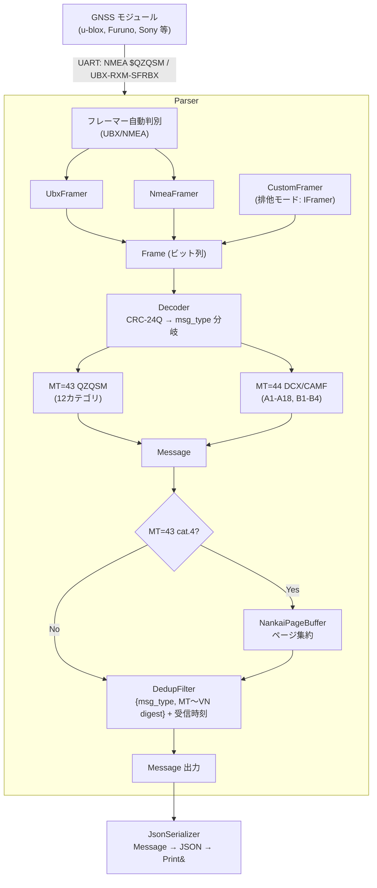
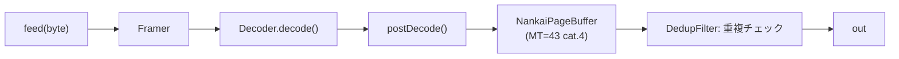
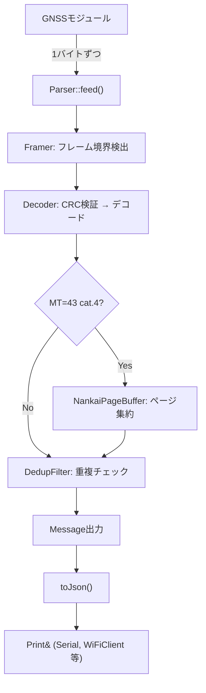

# azaraC アーキテクチャドキュメント

## 概要

azaraC は準天頂衛星システム（QZSS）の L1S 信号から災危通報メッセージをデコードする Arduino ライブラリです。本ドキュメントでは、ライブラリの内部アーキテクチャと設計思想について解説します。

ファイル構成は[開発者ガイド](developer-guide.md#プロジェクト構造)を参照してください。

## システム構成図（概略）

```mermaid
graph TD
    GNSS["GNSS モジュール<br/>(u-blox, Furuno, Sony 等)"]
    GNSS -->|"UART: NMEA $QZQSM / UBX-RXM-SFRBX"| Parser

    subgraph Parser
        FramerAuto["フレーマー自動判別<br/>(UBX/NMEA)"]
        UBX["UbxFramer"]
        NMEA["NmeaFramer"]
        FramerAuto --> UBX
        FramerAuto --> NMEA
        Custom["CustomFramer<br/>(排他モード: IFramer)"]
        UBX --> Frame
        NMEA --> Frame
        Custom --> Frame
        Frame["Frame (ビット列)"]
        Frame --> Decoder
        Decoder["Decoder<br/>CRC-24Q → msg_type 分岐"]
        Decoder --> MT43["MT=43 QZQSM<br/>(12カテゴリ)"]
        Decoder --> MT44["MT=44 DCX/CAMF<br/>(A1-A18, B1-B4)"]
        MT43 --> Msg["Message"]
        MT44 --> Msg
        Msg --> Nankai{"MT=43 cat.4?"}
        Nankai -->|"Yes"| NankaiBuf["NankaiPageBuffer<br/>ページ集約"]
        Nankai -->|"No"| Dedup["DedupFilter<br/>{msg_type, MT～VN digest} + 受信時刻"]
        NankaiBuf --> Dedup
        Dedup --> Out["Message 出力"]
    end

    Out --> Serializer
    Serializer["JsonSerializer<br/>Message → JSON → Print&"]
```

## コンポーネント詳細

### 1. Parser (パーサー)

[`Parser`](../src/Parser.h)はライブラリのメインエントリーポイントです。

- **フレーマー自動判別**: 入力バイトストリームからUBX/NMEAを自動判別（UBX同期文字`0xB5 0x62`、NMEA`$`文字で判定）
- **メッセージデコード**: フレームの復号とCRC検証
- **南海トラフ関連の重複除去+ページ集約**: `postDecode()` がNankai集約・重複チェック・メッセージ出力を一元管理

```mermaid
graph LR
    A["feed(byte)"] --> B["Framer"]
    B --> C["Decoder.decode()"]
    C --> D["postDecode()"]
    D --> E["NankaiPageBuffer<br/>(MT=43 cat.4)"]
    E --> F["DedupFilter: 重複チェック"]
    F --> G["out"]
```

### 2. Framer (フレーマー)

[`IFramer`](../src/framer/IFramer.h)インターフェースを実装:

| フレーマー | プロトコル | 対応デバイス |
|-----------|-----------|-------------|
| [`UbxFramer`](../src/framer/UbxFramer.h) | UBX-RXM-SFRBX | u-blox M10, ZED-F9P |
| [`NmeaFramer`](../src/framer/NmeaFramer.h) | NMEA $QZQSM | Furuno GT-87, 汎用GNSS |
| Custom (IFramer) | 任意 | Sony, その他 |

`Frame::svid` は QZSS L1S PRN を入れる契約です。Satellite ID は「PRN を表す 8bit の下位 6bit」（IS-QZSS-DCR-017 §4.3.1）なので、`NmeaFramer` は受け取った値を常に `svid | 0x80` して PRN に直します（仕様上有効な Satellite ID 53–63 → PRN 181–191）。`UbxFramer` は `ublox_qzss_svid_prn_map` に該当する場合だけ PRN へ変換し、181–191 はこの変換後の QZSS PRN に限ります。表に無い `svId` は範囲外の値を含めて入力値のまま通します。`JsonSerializer` は `svid` を数値のまま出力し、ラベルは付けません。

### 3. Decoder (デコーダー)

[`Decoder`](../src/decoder/Decoder.h)はビット列からメッセージフィールドを抽出します。

**共通処理**: CRC-24Q検証（IS-QZSS-L1S §3.2.8準拠）、MSB-firstビット抽出、UNIX時刻ベースの年月補正。

**MT=43**: `DecoderQzqsm`がX-macroテーブル`AZARAC_DC_CATEGORIES`から全12カテゴリのサポート判定・ディスパッチを生成。カテゴリ一覧は[APIリファレンス](api-reference.md#azaracmt43data-mt43-qzqsm)を参照。

**MT=44**: 階層構造のCAMFフォーマット（A1-A18 + B1-B4拡張）を解析。サービス種別（L-Alert, J-Alert等）の判定条件は[APIリファレンス](api-reference.md#azaracmt44data-mt44-dcxcamf)を参照。

### 4. DedupFilter (重複除去)

[`DedupFilter`](../src/internal/Dedup.h)はアプリケーションノートv2の実装にのっとって実装されています。

- **MT～VNで判定**: 発信元衛星によらず重複処理をするため、メッセージ本文のみを判定に使用します。具体的にはMT～VNフィールド（フレーム内bit 8..219, 計212bit）のCRC-24Qを保存します。メッセージをハッシュ化するため衝突の可能性を否定できませんが、本ライブラリではメモリ効率を優先してこの方式を採用しています。(参考:)
- **メッセージの保存期間**: 一定時間受信しなかった情報は履歴から削除するため種別ごとの`window_ms`以内に再受信したものを重複として扱います。なお再受信のたびに有効時間は更新されます。1通に複数種類のメッセージが入る場合は条件を満たすうち最長のものを採用し、アプリケーションノートに記載がなかったもの（MT=44CAMFなど）については `AZARAC_DEDUP_WINDOW_MS`を有効期限とします。
- **内部スキーマ**: セットアソシアティブ表（`AZARAC_DEDUP_SLOTS`÷`AZARAC_DEDUP_WAYS`セット）。満杯時は同一セット内の最も古い情報を置換します。受信当たりの走査は`WAYS`回で固定のため、`SLOTS`を増やしても計算コストが比例することはありません。
- **容量不足時の挙動**: 履歴のための容量が不足すると前述のとおり古いメッセージから順に削除されます。その後に同じメッセージを再び受信した場合は重複として扱われることなく再度通知されます。逆に、新規通知を優先するため取りこぼすことはないはずです。

  最適スロット数のための検証: (2024年のQZSSアーカイブから30日分取得、`make -C test dedup-realday`)

  | 同時メッセージ数 | 日数 | 256×8での再通知 | 512×8での再通知 |
  |---|---:|---:|---:|
  | 20–50 | 11 | 0 | 0 |
  | 51–100 | 13 | 0 | 0 |
  | 101–130 | 3 | 0 | 0 |
  | **327**（2024-08-28） | 1 | **2** | **0** |

  同時メッセージ数は **20〜327**（中央値 66）。**256×8で再通知が出たのは最悪日1日だけ**で、512×8では30日すべて取りこぼしや再通知なし。（`WAY=8`）:

  | 日 | distinct | 最大同時メッセージ数 | 64×8 | 128×8 | 256×8 | 512×8 |
  |---|---:|---:|---:|---:|---:|---:|
  | 2024-01-01（能登） | 162 | 75 | 52 | 0 | 0 | 0 |
  | 2024-04-02 | 34 | 33 | 0 | 0 | 0 | 0 |
  | 2024-07-24 | 237 | 95 | 1 | 1 | 0 | 0 |
  | 2024-08-07 | 106 | 68 | 1 | 0 | 0 | 0 |
  | **2024-08-28**（台風10号） | **456** | **327** | 6 | 2 | 2 | **0** |

  最大同時メッセージ数がスロット数のおおむね1/2を超えると再通知が出始める。最悪日（08-28）は最大で同時に327件で、256×8でも2件再通知がされた。能登半島地震などの瞬発的な通知が多い日を見ると128×8で足りるように見えるが、台風など地域別で細かく予報が出る場合、スロット数が不足する。注: **南海トラフ本震のような同時メッセージ数がこれを超えると思われるシナリオは未検証**。

  能登（2024-01-01）のカテゴリ別内訳:

  | 容量 | 全体 | 震源(2) | 震度(3) | 降灰(9) | 海上(14) |
  |---|---:|---:|---:|---:|---:|
  | 16×8 (128 B) | 750 | 227 | 279 | 59 | 185 |
  | 32×8 (256 B) | 329 | 96 | 128 | 25 | 80 |
  | 64×8 (512 B) | 52 | 9 | 33 | 7 | 3 |
  | 128×8 (1 KB) | 0 | 0 | 0 | 0 | 0 |

  影響は同時メッセージ数で決まる。16×8の再通知は震度279件（保存期間内のメッセージはピークで36件）> 震源227件 > 海上185件 > 降灰59件の順。緊急地震速報1件（有効期限5分・期限内4件）と津波5件（期限内12種）は16×8でも再通知0。よって必要スロット数は再放送の回数ではなく保存期間内のメッセージが支配する（津波は 6,872 通と最多だが生存 12 種のみ）。

  残る2カテゴリは本テストの対象外:

  - **南海トラフ(4)**: 重複判定はMT～VNフィールドではなく`info_code` + 報告時刻で判定を行うため対象外。詳細は後述。
  - **北西太平洋津波(6)**: 今回収集した30日間では観測されなかった。テストでは`test/integration/test_realdata.cpp`で検証。

  同じ日でも衛星ごとに中身が違う（`.l1s` は衛星別。例 2024-08-07: Q002=distinct 106/生存68 → Q005=148/110）。`REALDAY_INPUT` を Q003..Q005 に切り替えるとカテゴリ被覆が増える。
  
- **既定値**: 512スロット×8ウェイ = 4KB。30日すべてでFALSE_RE=0/MISSED=0（保存期間内のピークは日によって20〜327件、このテストでの最悪値は2024-08-28の 327）。256×8では最悪日に2件残るため、今回観測された範囲まで余裕を持たせるなら512スロット推奨。能登1日だけなら128で足りるため、場合によっては受信カテゴリを絞るのも選択肢となる。AVRプリセットは64×8=512B（能登のSEISMIC/TSUNAMI部分に限定した計測: 8,669フレーム / distinct 77 で 0件、32×8 も 0件、16×8 は 93件、16×4では106件。AVRの対象カテゴリは震度・津波なので、気象・台風が主体の2024-08-28のような日であふれることはない）。
- **南海トラフでの重複判定**: 南海トラフの集約メッセージは、メッセージ一件ごと（`info_code`+報告時刻）で識別します。到着順でどのページが最後になるかは変わるため、集約済みテキストによる判定では同じ事象を再放送のたびに別情報と判定してしまいます。集約には`DedupKey::synthetic`で名前空間を分けており、値が一致しても衝突しません。事象鍵は`information_type`を含まないため、発表（窓24時間）と取消（窓2時間）が同一 `info_code` + 同一報告時刻で同じ鍵に載り得ます（この場合再通知は生じませんが、仮に同じ事象を取消→発表の順で受信すると通知が抑制されます。ただし実際には考えにくいケースなので無視できると思います）。

### 5. NankaiPageBuffer (南海トラフページ集約)

[`NankaiPageBuffer`](../src/internal/NankaiPageBuffer.h)は最大63ページに分割される南海トラフ地震メッセージを集約。`MAX_PAGES×18+1`バイトのメモリを確保し、受信したページをビットマップで管理しながら直接書き込む（ソート不要）。バッファが全て使用中の場合はLRUエビクションで最も古いバッファから解放。

### 6. JsonSerializer (JSONシリアライザ)

[`JsonSerializer`](../src/json/JsonSerializer.h)はMessageをJSON形式にシリアライズ。ヒープ割り当てはせず固定バッファで処理。`Print&`経由で出力（Serial, WiFiClient等）。日本語/英語ラベルの選択的コンパイルに対応。

## データフロー

```mermaid
graph TD
    A["GNSSモジュール"] -->|"1バイトずつ"| B["Parser::feed()"]
    B --> C["Framer: フレーム境界検出"]
    C --> D["Decoder: CRC検証 → デコード"]
    D --> E{"MT=43 cat.4?"}
    E -->|"Yes"| E2["NankaiPageBuffer: ページ集約"]
    E -->|"No"| F["DedupFilter: 重複チェック"]
    E2 --> F
    F --> G["Message出力"]
    G --> H["toJson()"]
    H --> I["Print& (Serial, WiFiClient 等)"]
```

## メモリ設計

| コンポーネント | メモリ使用量 | 備考 |
|---------------|-------------|------|
| DedupFilter | `AZARAC_DEDUP_SLOTS × 8` B | 既定 4,096B（512スロット。AVRプリセットは512B）。1エントリ = CRCが4B+受信時刻4B |
| NankaiPageBuffer | 28B（メタデータ）+ `MAX_PAGES × 18 + 1` B | 既定 63 ページで構造体 1,168B。LRUエビクション |
| 定義テーブル | 表エントリ39本で約122KiB、定義文字列を含むライブラリ全体の読み取り専用セクションは約344KiB。計測条件: 全カテゴリ + 日英ラベル有効、64bit ホスト `g++ 15.2 -std=c++17 -O2 -fdata-sections`（未使用 4 表を生成対象から外す前の実測） | Flash(AVRではPROGMEM)に配置。同一TU内の同一リテラルは定数プールで同じコピーに統合されるが、TUを跨ぐ統合はツールチェーン依存。非AVRはエントリを `const char*`（32bit機で4B）で保持。AVRプリセット（`-D__AVR__ -DAZARAC_AVR_STUB`、SEISMIC/TSUNAMI のみ、`-O0`）では表 + プール計約3.4KiB |

## 関連ドキュメント

- [API リファレンス](api-reference.md)
- [開発者ガイド](developer-guide.md)
