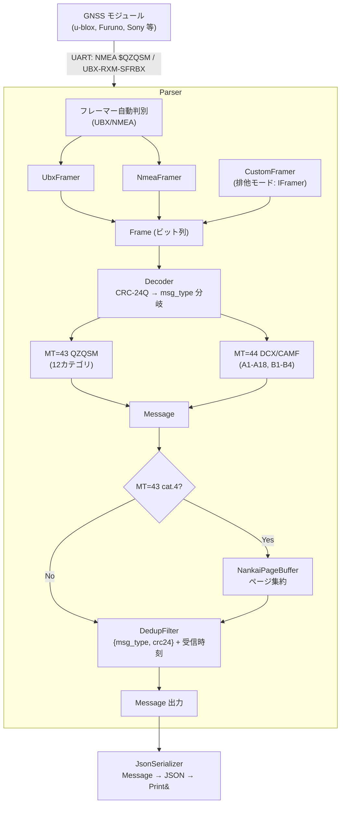
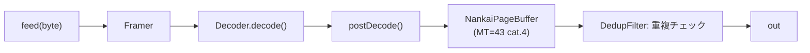
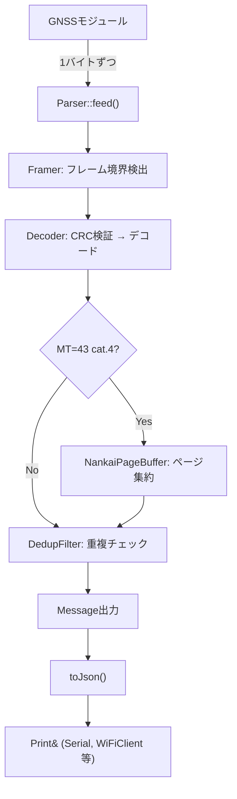

# AzaraC アーキテクチャドキュメント

## 概要

AzaraCは準天頂衛星システム（QZSS）のL1S信号から災危通報メッセージをデコードするArduinoライブラリです。本ドキュメントでは、ライブラリの内部アーキテクチャと設計思想について解説します。

ファイル構成は[開発者ガイド](developer-guide.md#プロジェクト構造)を参照してください。

## システム構成図

```mermaid
graph TD
    GNSS["GNSS モジュール<br/>(u-blox, Furuno, Sony 等)"]
    GNSS -->|"UART: NMEA $QZQSM / UBX-RXM-SFRBX"| Parser

    subgraph Parser
        FramerAuto["フレーマー自動判別<br/>(UBX/NMEA)"]
        UBX["UbxFramer"]
        NMEA["NmeaFramer"]
        FramerAuto --> UBX
        FramerAuto --> NMEA
        Custom["CustomFramer<br/>(排他モード: IFramer)"]
        UBX --> Frame
        NMEA --> Frame
        Custom --> Frame
        Frame["Frame (ビット列)"]
        Frame --> Decoder
        Decoder["Decoder<br/>CRC-24Q → msg_type 分岐"]
        Decoder --> MT43["MT=43 QZQSM<br/>(12カテゴリ)"]
        Decoder --> MT44["MT=44 DCX/CAMF<br/>(A1-A18, B1-B4)"]
        MT43 --> Msg["Message"]
        MT44 --> Msg
        Msg --> Nankai{"MT=43 cat.4?"}
        Nankai -->|"Yes"| NankaiBuf["NankaiPageBuffer<br/>ページ集約"]
        Nankai -->|"No"| Dedup["DedupFilter<br/>{msg_type, crc24} + 受信時刻"]
        NankaiBuf --> Dedup
        Dedup --> Out["Message 出力"]
    end

    Out --> Serializer
    Serializer["JsonSerializer<br/>Message → JSON → Print&"]
```

## コンポーネント詳細

### 1. Parser (パーサー)

[`Parser`](../src/Parser.h)はライブラリのメインエントリーポイントです。

- **フレーマー自動判別**: 入力バイトストリームからUBX/NMEAを自動判別（UBX同期文字`0xB5 0x62`、NMEA`$`文字で判定）
- **メッセージデコード**: フレームの復号とCRC検証
- **重複除去 + 南海トラフページ集約**: `postDecode()` がNankai集約・重複チェック・メッセージ出力を一元管理

```mermaid
graph LR
    A["feed(byte)"] --> B["Framer"]
    B --> C["Decoder.decode()"]
    C --> D["postDecode()"]
    D --> E["NankaiPageBuffer<br/>(MT=43 cat.4)"]
    E --> F["DedupFilter: 重複チェック"]
    F --> G["out"]
```

### 2. Framer (フレーマー)

[`IFramer`](../src/framer/IFramer.h)インターフェースを実装:

| フレーマー | プロトコル | 対応デバイス |
|-----------|-----------|-------------|
| [`UbxFramer`](../src/framer/UbxFramer.h) | UBX-RXM-SFRBX | u-blox M10, ZED-F9P |
| [`NmeaFramer`](../src/framer/NmeaFramer.h) | NMEA $QZQSM | Furuno GT-87, 汎用GNSS |
| Custom (IFramer) | 任意 | Sony, その他 |

`Frame::svid` は QZSS L1S PRN を入れる契約で、変換で得られる値は **128–255**（仕様上有効な Satellite ID 53–63 なら **181–191**）。Satellite ID は「PRN を表す 8bit の下位 6bit」
（IS-QZSS-DCR-017 §4.3.1）なので、`NmeaFramer`は常に`svid | 0x80`する（53→181, 54→182, 55–63→183–191。仕様外の ID は 0–52 が 128–180、64–127 が 192–255 に落ちる）。`UbxFramer`は`ublox_qzss_svid_prn_map`に該当する場合だけ PRN へ変換し、表に無い`svId`は範囲外の値を含めてそのまま通す。`JsonSerializer`は`svid`をそのまま出し、ラベルは付けない（v2。v1 の`svid_label`は`& 0x3F`で`qzss_dcr_satellite_prn`を引いていた）。

### 3. Decoder (デコーダー)

[`Decoder`](../src/decoder/Decoder.h)はビット列からメッセージフィールドを抽出します。

**共通処理**: CRC-24Q検証（IS-QZSS-L1S §3.2.8準拠）、MSB-firstビット抽出、UNIX時刻ベースの年月補正。

**MT=43**: `DecoderQzqsm`がX-macroテーブル`AZARAC_DC_CATEGORIES`から全12カテゴリのサポート判定・ディスパッチを生成。カテゴリ一覧は[APIリファレンス](api-reference.md#azaracmt43data-mt43-qzqsm)を参照。

**MT=44**: 階層構造のCAMFフォーマット（A1-A18 + B1-B4拡張）を解析。サービス種別（L-Alert, J-Alert等）の判定条件は[APIリファレンス](api-reference.md#azaracmt44data-mt44-dcxcamf)を参照。

### 4. DedupFilter (重複除去)

[`DedupFilter`](../src/internal/Dedup.h)はアプリケーションノートv2（原PDF p.23–25）の重複判定をそのまま実装します。

- **同一性は内容**: 250ビットのフレームに衛星IDは含まれないため、情報の同一性は`{msg_type, crc24}`（MT～VN）の一致で判定します。受信衛星は鍵に含めません（複数衛星から中継された同一情報を1回だけ通知するため）。
- **情報有効時間**: 手順④'「一定時間受信しなかった情報は履歴から削除する」に従い、`window_ms`以内に再受信した情報だけを重複と判定します。再受信のたびに有効時間は更新されます。カテゴリごとの配信終了条件（原PDF p.26–27）は`AZARAC_DEDUP_WINDOW_MS`で呼び出し側が調整します。
- **構造**: セットアソシアティブ表（`AZARAC_DEDUP_SLOTS`÷`AZARAC_DEDUP_WAYS`セット、セット選択は内容のハッシュ）。満杯時は同一セット内で最も古い情報を置換します（新着を捨てる巡回リングではない）。1決定あたりの走査は`WAYS`で頭打ちになるため、スロット数を増やしてもコストは容量に比例しません。
- **既定値**: 64スロット×8ウェイ = 512B。24時間有効な津波警報と複数の同時情報を保持するため。RAM制約のあるターゲットでは`AZARAC_DEDUP_SLOTS`を16〜32に落とします（AVRプリセットは16×4 = 128B）。
- **集約結果の同一性**: 南海トラフの集約メッセージは、ページ集合を完成させた電文の`crc24`ではなく事象そのもの（`info_code` + 報告時刻）で識別します。到着順でどのページが最後になるかは変わるため、電文の鍵では同じ事象を再放送のたびに別情報と判定してしまいます。集約鍵は`DedupKey::synthetic`で電文鍵と名前空間を分けており、値が一致しても衝突しません。

### 5. NankaiPageBuffer (南海トラフページ集約)

[`NankaiPageBuffer`](../src/internal/NankaiPageBuffer.h)は最大63ページに分割される南海トラフ地震メッセージを集約。`MAX_PAGES×18+1`バイトのメモリを確保し、受信したページをビットマップで管理しながら直接書き込む（ソート不要）。バッファが全て使用中の場合はLRUエビクションで最も古いバッファから解放。

### 6. JsonSerializer (JSONシリアライザ)

[`JsonSerializer`](../src/json/JsonSerializer.h)はMessageをJSON形式にシリアライズ。ヒープアロケーションなし、固定バッファで処理。`Print&`経由で出力（Serial, WiFiClient等）。日本語/英語ラベルの選択的コンパイルに対応。

## データフロー

```mermaid
graph TD
    A["GNSSモジュール"] -->|"1バイトずつ"| B["Parser::feed()"]
    B --> C["Framer: フレーム境界検出"]
    C --> D["Decoder: CRC検証 → デコード"]
    D --> E{"MT=43 cat.4?"}
    E -->|"Yes"| E2["NankaiPageBuffer: ページ集約"]
    E -->|"No"| F["DedupFilter: 重複チェック"]
    E2 --> F
    F --> G["Message出力"]
    G --> H["toJson()"]
    H --> I["Print& (Serial, WiFiClient 等)"]
```

## メモリ設計

| コンポーネント | メモリ使用量 | 備考 |
|---------------|-------------|------|
| DedupFilter | `AZARAC_DEDUP_SLOTS × 8` B | 既定 512B（64スロット）。1エントリ = 内容4B + 受信時刻4B |
| NankaiPageBuffer | 28B（メタデータ）+ `MAX_PAGES × 18 + 1` B | 既定 63 ページで構造体 1,168B。LRUエビクション |
| 定義テーブル | 表エントリ39本で約122KiB、定義文字列を含むライブラリ全体の読み取り専用セクションは約344KiB（12TU+空のmainをリンク）。同一TU内の同一リテラルは定数プールで同じコピーに統合されるが、TUを跨ぐ統合はツールチェーン依存。計測条件: 全カテゴリ + 日英ラベル有効、64bit ホスト `g++ 15.2 -std=c++17 -O2 -fdata-sections` | Flash(AVRではPROGMEM)に配置。非AVRはエントリを `const char*`（32bit機で4B）で保持。AVRプリセット（`-D__AVR__ -DAZARAC_AVR_STUB`、SEISMIC/TSUNAMI のみ、`-O0`）では表 + プール計約3.4KiB |

## 関連ドキュメント

- [API リファレンス](api-reference.md)
- [開発者ガイド](developer-guide.md)
